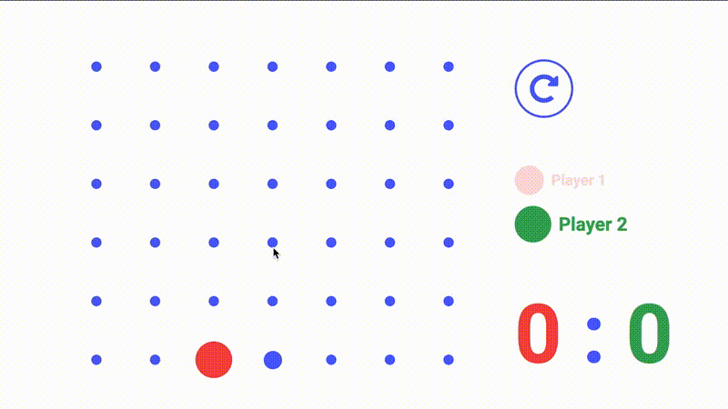
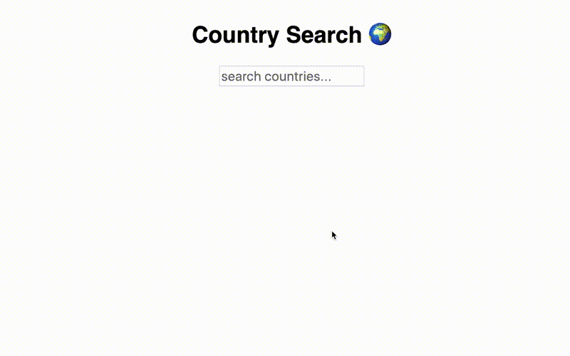
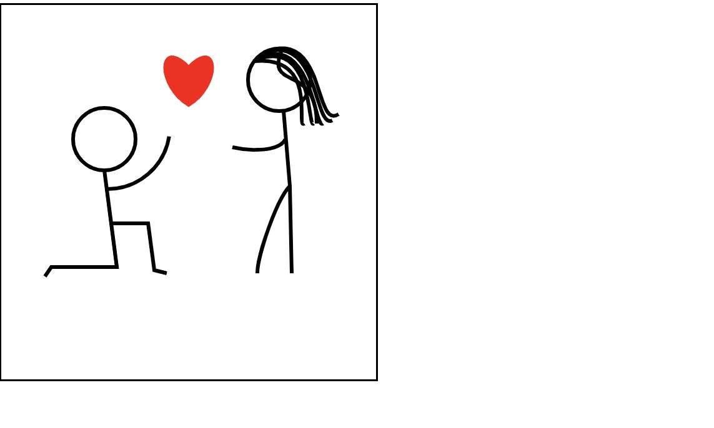
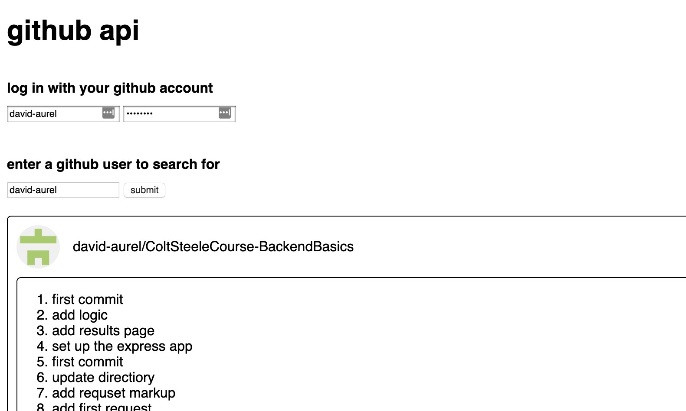
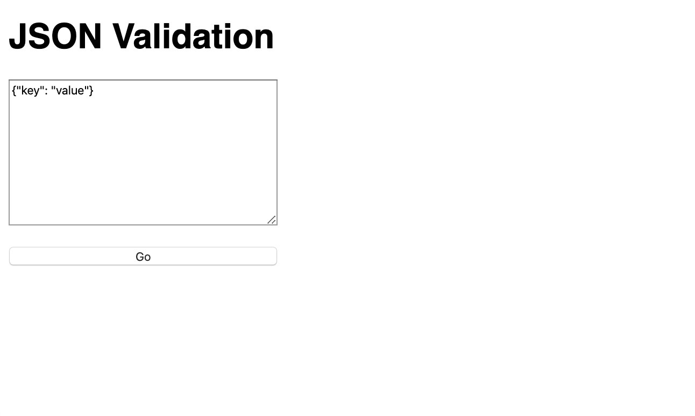
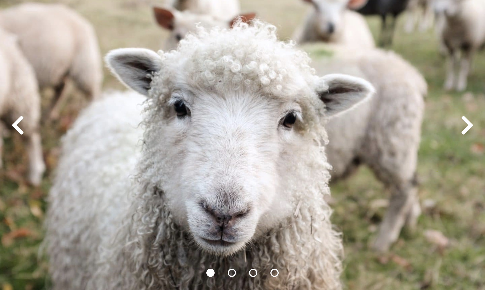
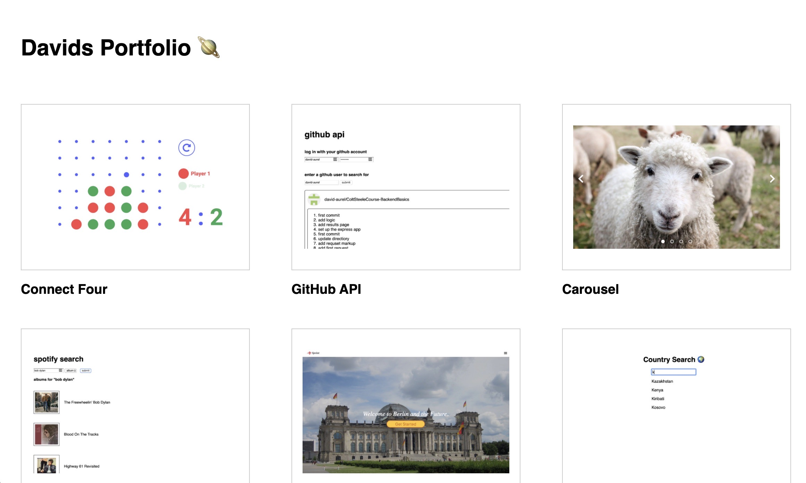
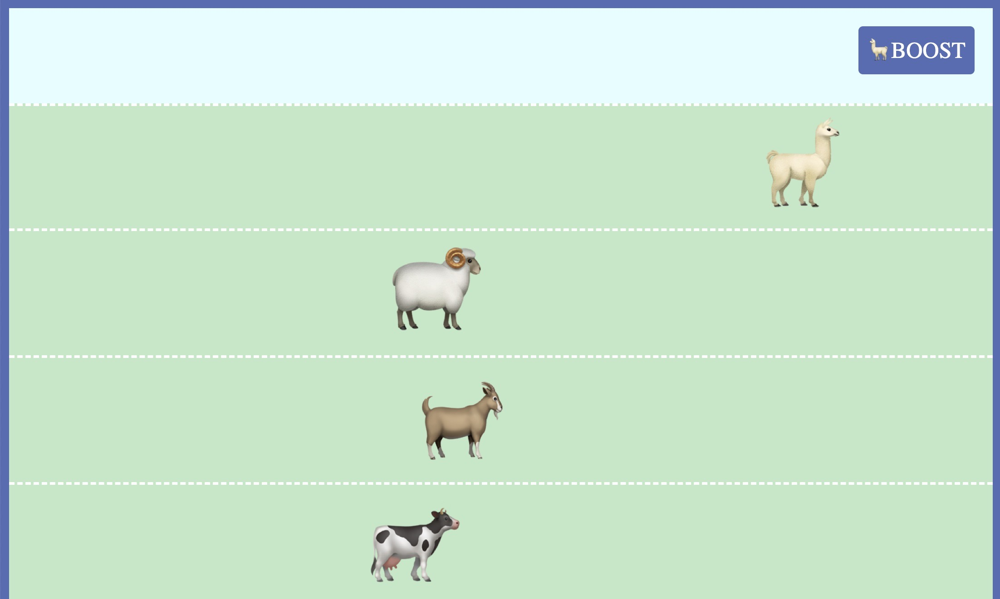
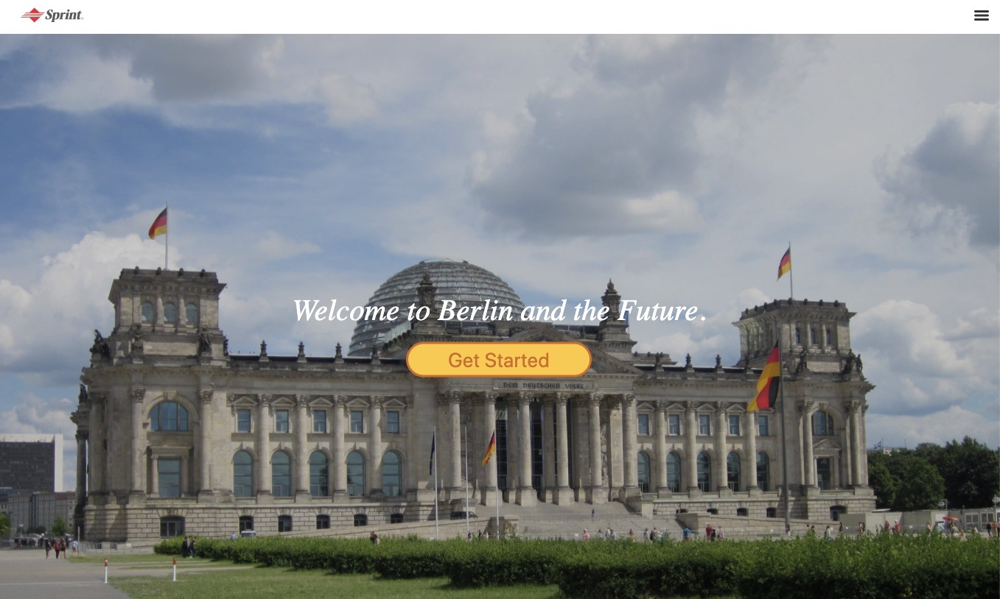
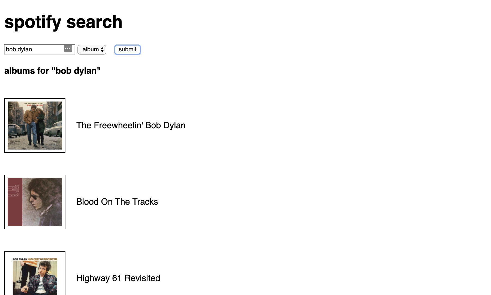

# Projects

## Connect Four

**Classic two player connect four game, built in Javascript with jQuery.**

This was my favorite project to make, ever! It was one of those weekends where I was so immersed I almost forgot to eat. There were a lot of challenging parts to this one, for example, figuring out when somebody's won diagonally! I wanted to make it as accessible as possible, so the game is fully playable using the keyboard. Something I'd like to add in the future is the functionality to make if fully playable using a screen reader and voice commands. I then spent a big amount of time styling it, which was also extremely rewarding, when it all came together in the end.

**Features:**

* Game logic for moving the pieces and determining when a win has occured using Javascript with jQuery.
* Intuitive UX with CSS animations
* Strong focus on accessibility

## Incremental Search

# Incremental Search

**Show list of countries that match the user's input, done in vanilla Javascript.**

This project helped me a lot to become more familiar with DOM Manipulations and at the time I thought it was just the coolest thing ever.

## News Ticker

# Live Ticker

**A ticker showing links crawling across the screen**

This project taught me a lot about the frustration that can come up during programming. Let's just leave it at that 😉

#### Features:

- A list of links is being moved across the screen with vanilla Javascript code, so that it loops
- Refactored the code to accept an argument for the direction of the movement
- Refactored the code using jQuery
- Replaced the list of links with results from the Twitter API
- Implemented the functionality to get results from multiple twitter accounts, rather than just one
- Refactored the code to obtain the results from different sources simultaniously

## Canvas

**Javascript drawing on an HTML `<canvas>` element.**

## Github API

## JSON Validator

## Image Carousel

## Panes

## Portfolio

## Racing Game

## Landing Page

## Spotify API

